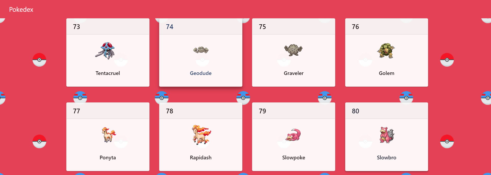

# [PokeDex](https://poke-dex-pokemon.netlify.app/)

---
## overview
This project is a Pokedex built using React. It allows users to browse and search for Pokémon, view detailed information about each Pokémon such as stats, abilities, and type, and explore data from the PokéAPI.

## Features
Search Pokémon: Search for any Pokémon by name or ID.
Pokémon Details: View detailed information about each Pokémon, including stats, abilities, types, and images.
Responsive Design: The app is fully responsive, adapting to both mobile and desktop devices.
Pagination: Browse through a list of Pokémon with pagination support.
Error Handling: Gracefully handle errors such as invalid Pokémon names or API errors.

Installation
To run this project locally, follow these steps:

Clone the repository:

bash
Copy code
git clone https://github.com/yourusername/pokedex-app.git
cd pokedex-app
Install the dependencies:

bash
Copy code
npm install
Start the development server:

bash
Copy code
npm start
The app will be available at http://localhost:3000.

Usage
Search Pokémon: Use the search bar to enter a Pokémon's name or ID to fetch its details.
View Pokémon Details: Clicking on a Pokémon card will show more information about its abilities, stats, type, and evolutions.
Pagination: Browse through a list of Pokémon with the pagination feature.
Error Handling: Invalid searches or failed API requests will display appropriate error messages.

Example
When you open the app:

A list of Pokémon will be displayed.
You can search for Pokémon by name or ID and view detailed information about them.
The app includes pagination to browse through all available Pokémon.
Dependencies
React: Frontend framework for building the UI.
Axios: For making API requests to the PokéAPI.
CSS or Styled Components: For styling the app.

